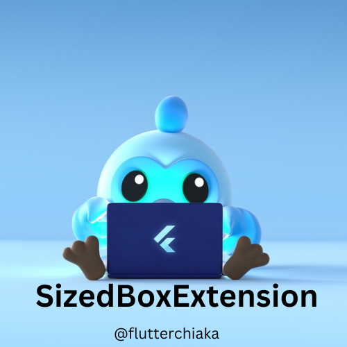

<p align="center">
  
</p>

<h1 align="center">Sized Box Extension</h1>

<p align="center">
  <b>A Flutter package that extends <code>num</code> to simplify <code>SizedBox</code> widget creation.</b>
</p>

<p align="center">
  <a href="https://pub.dev/packages/sized_box_extension"></a>
  <a href="https://github.com/Hikmatullohprogramist/sized_box_extension"></a>
  <a href="https://github.com/Hikmatullohprogramist/sized_box_extension/issues"></a>
</p>

---

## 📦 Installation

Add the following line to your `pubspec.yaml` under dependencies:

```yaml
dependencies:
  sized_box_extension: ^0.0.1

``````
<p align="center">
  Made with ❤️ by <a href="https://github.com/Hikmatullohprogramist">Flutterchi aka</a>
</p>

